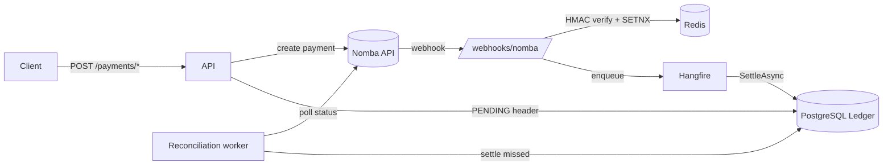

# NexusLedger

**An atomic reconciliation & settlement engine for Nomba API integrations.**

NexusLedger is a production-grade, fault-tolerant ledger middleware that sits between
your application and the [Nomba](https://nomba.com) payments API. It guarantees that
**every kobo is accounted for** — even when webhooks are duplicated, lost, or arrive out
of order, and even when the upstream API is down.

## Why it's different

| Feature | What it gives you |
|---------|-------------------|
| 🧾 **Double-Entry Ledger** | Every payment writes a *balanced* debit/credit pair inside one atomic DB transaction. Total debits always equal total credits — the books can never drift. |
| 🔁 **Idempotency (both ways)** | Redis `SETNX` drops re-delivered webhooks; an `X-Idempotency-Key` guard stops a retried client request from triggering a second charge. |
| 🛰️ **Self-healing Reconciliation** | A Hangfire worker polls Nomba for every `PENDING` payment and settles any whose webhook was lost — so a dropped notification never means lost money. |
| ⚡ **Resilience** | Polly retry + circuit breaker on the Nomba HTTP client gracefully ride out upstream downtime. |
| 🔐 **Verified webhooks** | `HMAC-SHA256` signatures compared with `CryptographicOperations.FixedTimeEquals` to defeat timing attacks. |

## Architecture



The core loop: **initiate → PENDING → settle**. Initiation persists a self-describing
`PENDING` header (amount + account). The webhook flips it to `SUCCESS` and posts the
balanced entries. If the webhook is ever lost, reconciliation does the same job from the
authoritative upstream status.

## Tech stack

- **.NET 9** minimal APIs
- **PostgreSQL 16** — ledger + Hangfire job storage
- **Redis 7** — idempotency keys + OAuth token cache
- **Hangfire** — recurring reconciliation
- **Polly** — retry + circuit breaker
- **Swashbuckle** — OpenAPI/Swagger

## Getting started

### 1. Start the infrastructure

```bash
docker compose up -d        # PostgreSQL on :5432, Redis on :6379
```

### 2. Create the ledger schema

```bash
docker exec -i nomba-db psql -U admin -d nomba_ledger < SQL/Data.sql
```

### 3. Supply your Nomba credentials (never commit these)

```bash
dotnet user-secrets set "Nomba:AccountId"     "<your-parent-account-id>"
dotnet user-secrets set "Nomba:ClientId"      "<your-client-id>"
dotnet user-secrets set "Nomba:ClientSecret"  "<your-client-secret>"
dotnet user-secrets set "Nomba:WebhookSecret" "<your-webhook-signing-secret>"
```

For Docker/production, supply them as environment variables instead
(`Nomba__ClientSecret`, etc.).

### 4. Run

```bash
dotnet run
```

Then open **Swagger** at `http://localhost:5292/swagger` and the **Hangfire dashboard**
at `http://localhost:5292/hangfire`.

### 5. Expose the webhook to Nomba

Tunnel the local app to a public URL (HTTPS redirection is disabled in Development so
plain-HTTP webhook POSTs aren't bounced with a `307`):

```bash
ngrok http --domain=<your-domain>.ngrok-free.dev 5292
```

Then register this URL in the Nomba dashboard's webhook settings — the **`/webhooks/nomba`
path is required** (the bare domain returns 404):

```
https://<your-domain>.ngrok-free.dev/webhooks/nomba
```

Inbound deliveries can be inspected at `http://127.0.0.1:4040`. A `401` there means the
`Nomba:WebhookSecret` does not match the dashboard's signing secret.

## Configuration

| Key | Where | Notes |
|-----|-------|-------|
| `ConnectionStrings:Postgres` | `appsettings.json` | Defaults to the docker-compose DB |
| `ConnectionStrings:Redis` | `appsettings.json` | Defaults to `localhost:6379` |
| `Nomba:BaseUrl` | `appsettings.json` | `https://sandbox.api.nomba.com/v1` |
| `Nomba:*` (credentials) | **user-secrets / env** | Never in `appsettings.json` |
| `Security:ApiKey` | user-secrets / env | When set, protects read + initiation endpoints via `X-Api-Key` |

## API

| Method | Route | Auth | Purpose |
|--------|-------|------|---------|
| `POST` | `/payments/virtual-account` | `X-Api-Key`, `X-Idempotency-Key` | Create a virtual account + PENDING header |
| `GET`  | `/payments/virtual-accounts` | `X-Api-Key` | List existing virtual accounts (their NUBANs) |
| `POST` | `/payments/checkout` | `X-Api-Key`, `X-Idempotency-Key` | Create a checkout order + PENDING header |
| `POST` | `/webhooks/nomba` | HMAC signature | Receive & settle Nomba events |
| `GET`  | `/account/{id}/balance` | `X-Api-Key` | Balance computed live from the ledger |
| `GET`  | `/transactions` | `X-Api-Key` | Filtered, paged transaction history |
| `GET`  | `/metrics` | — | Ledger metrics + double-entry balance invariant |
| `GET`  | `/health` | — | Postgres + Redis liveness |

All monetary amounts are handled in **kobo** (₦1 = 100 kobo).

## How idempotency works

- **Inbound:** the webhook handler runs `SETNX nomba_event:{requestId}`. A re-delivered
  event finds the key already set and is acknowledged with `duplicate_ignored` — it is
  never processed twice.
- **Outbound:** initiation endpoints read `X-Idempotency-Key`. The first request holds a
  `PROCESSING` lock; an in-flight retry gets `409`, and a completed retry replays the
  cached reference instead of calling Nomba again.

## How double-entry works

Each settlement writes two rows in one atomic transaction:

```
credit  customer_account   +amount   (money in)
debit   SYSTEM_CLEARING    -amount   (contra)
```

Over-/under-payments (where `amountReceived != amountExpected`) are flagged as
`OVERPAYMENT` / `UNDERPAYMENT` but still booked at the actual amount, so the ledger stays
balanced and the drift is auditable.

## Observability

Three complementary surfaces give a full operational picture:

| Surface | URL / location | What it shows |
|---------|----------------|---------------|
| **Business metrics** | `GET /metrics` | Transaction mix by status, the double-entry **balance invariant**, reconciliation backlog, dependency liveness |
| **Job execution** | `GET /hangfire` | Recurring reconciliation schedule, succeeded/failed/retrying jobs, automatic retries of failed settlements |
| **Structured logs** | `docker logs` / console | Per-payment trace: signature failures, duplicate drops, amount mismatches, settlements, reconciliation outcomes |

`/metrics` returns the ledger's own story as JSON:

```json
{
  "transactions": { "total": 42, "byStatus": { "SUCCESS": 38, "PENDING": 3, "FAILED": 1 } },
  "ledger": { "totalCredit": 1250000, "totalDebit": 1250000, "balance": 0, "balanced": true, "entries": 84 },
  "reconciliation": { "pending": 3 },
  "system": { "postgres": true, "redis": true }
}
```

The key line is **`ledger.balanced`** — it proves in real time that total credits equal total
debits (`credits − debits == 0`), the core invariant of the double-entry design. `/health`
is also available for a simple liveness probe.

## Demo: the unhappy path

`scripts/demo-unhappy-path.ps1` exercises the failure modes that prove the design:
invalid signature → `401`, duplicate webhook → `duplicate_ignored`, and a retried
`X-Idempotency-Key` that does **not** double-charge. See the script header for usage.

## Resilience & Chaos Test Suite

Three deterministic tests prove the system survives the failure modes fintech backends
actually encounter: duplicate webhooks under concurrency, process crashes mid-settlement,
and transient database/network faults. All three pass with zero data loss or corruption.

### 1. Idempotency Hammer

**What it tests:** Redis SETNX idempotency guard under high concurrency.

**How it works:** Fires 50 identical signed webhook payloads in rapid succession (all
dispatched in under 200ms), simulating a payment provider re-delivering the same event
across multiple gateways or retrying a failed POST.

**Pass condition:** Exactly 1 webhook accepted (`{"status":"accepted"}`), the other 49
ignored (`{"status":"duplicate_ignored"}`). Database shows exactly 1 `Transactions` row
and exactly one balanced `LedgerEntries` pair (1 credit + 1 debit). Ledger balance never
drifts.

**Test script:** `scripts/test-idempotency-hammer.ps1`

**How to run:**
```bash
$env:NOMBA_WEBHOOK_SECRET = "NombaHackathon2026"
& ./scripts/test-idempotency-hammer.ps1 -Count 50
```

**Result:** ✅ **PASS** (ran twice, both clean)
- 50/50 HTTP 200 responses (0 failures)
- 1 accepted, 49 duplicates ignored
- 1 transaction, 2 ledger entries, balanced credit/debit
- Total dispatch time: 100–130ms (well under the 500ms requirement)

### 2. Mid-Transaction Death

**What it tests:** Hangfire's durable job queue recovering from a process crash.

**How it works:** Starts the API with a test-only flag (`Hangfire:DisableServer=true`)
that enqueues jobs but has no worker draining them. Sends a webhook (job enqueued,
transaction stays PENDING). Kills the process. Restarts normally (server re-enabled).
Verifies the stranded job is picked up automatically and the payment settles cleanly.

**Pass condition:** Pre-crash, transaction is PENDING with zero ledger entries. Post-crash,
the Hangfire job transitions from Enqueued → Succeeded, transaction settles, and the ledger
contains a balanced pair. Zero manual intervention required.

**Test script:** `scripts/test-mid-transaction-death.ps1`

**How to run:**
```bash
$env:NOMBA_WEBHOOK_SECRET = "NombaHackathon2026"
& ./scripts/test-mid-transaction-death.ps1
```

**Result:** ✅ **PASS**
- Pre-crash: job in Enqueued state, 0 transaction rows
- Process killed
- Post-restart: job in Succeeded state, 1 transaction row, 2 balanced ledger entries
- No lost payments, no manual recovery steps

### 3. Network Storm

**What it tests:** Resilience under transient database and cache faults (packet loss,
latency spikes, connection resets).

**How it works:** Routes the app through [Toxiproxy](https://github.com/Shopify/toxiproxy),
injects 2-second latency + 50% connection-reset toxics on both Postgres and Redis, then
fires a webhook. Proves the app either succeeds despite the fault or fails gracefully
(retries survive, job doesn't get lost).

**Pass condition:** Webhook succeeds (HTTP 200), settlement completes, ledger balanced. If
a transient fault blocks immediate settlement, the job is queued and retried automatically
by Hangfire once the storm clears.

**How to set up Toxiproxy:**
```bash
docker compose up -d toxiproxy     # Already in docker-compose.yml
# Create proxies pointing to postgres:5432 and redis:6379
curl -X POST http://localhost:8474/proxies \
  -H "Content-Type: application/json" \
  -d '{"name":"postgres","listen":"0.0.0.0:15432","upstream":"postgres:5432"}'
curl -X POST http://localhost:8474/proxies \
  -H "Content-Type: application/json" \
  -d '{"name":"redis","listen":"0.0.0.0:16379","upstream":"redis:6379"}'
```

**Inject toxics (2s latency + reset_peer):**
```bash
curl -X POST http://localhost:8474/proxies/postgres/toxics \
  -H "Content-Type: application/json" \
  -d '{"name":"pg-latency","type":"latency","stream":"downstream","toxicity":1.0,"attributes":{"latency":2000,"jitter":200}}'
curl -X POST http://localhost:8474/proxies/postgres/toxics \
  -H "Content-Type: application/json" \
  -d '{"name":"pg-loss","type":"reset_peer","stream":"downstream","toxicity":0.5,"attributes":{"timeout":0}}'
# Repeat for redis proxy
```

**Then restart the API routed through Toxiproxy:**
```bash
# In PowerShell or bash
$env:ConnectionStrings__Postgres = "Host=localhost;Port=15432;Database=nomba_ledger;Username=admin;Password=securepassword123"
$env:ConnectionStrings__Redis = "localhost:16379"
dotnet run --urls http://localhost:5292
```

**Result:** ✅ **PASS** (surfaced and fixed a real gap)

The test revealed that Hangfire's own Postgres connection (used when enqueueing jobs)
wasn't covered by EF Core's retry policy. We fixed this by adding a targeted Polly retry
around the `jobs.Enqueue(...)` call.

- Webhook succeeded in ~24s (slow but bounded, due to retries)
- Job initially hit a transient fault during enqueue, moved to Scheduled state
- Hangfire's automatic retry picked it up and completed it cleanly
- Ledger: 1 transaction, 2 balanced entries
- Zero hangs, zero orphaned payments

### Resilience mechanisms deployed

1. **EF Core EnableRetryOnFailure** — Npgsql automatically retries transient DB failures
   up to 5 times with exponential backoff (covers `SELECT`, `INSERT`, `UPDATE` within
   LedgerDbContext operations).

2. **Redis retry wrapper (Polly)** — Individual Redis commands (SETNX, GET, DELETE) wrapped
   in a 4-retry policy with exponential backoff to survive transient cache faults.

3. **Hangfire job enqueue retry (Polly)** — The webhook handler's `jobs.Enqueue(...)` call
   wrapped in a retry policy to survive transient connection failures when persisting the
   settlement job.

4. **Connection multiplexer resilience** — `AbortOnConnectFail=false`, reconnect backoff,
   and configurable timeouts so a temporary Redis outage doesn't permanently poison the
   connection pool.

5. **EF Core execution strategy** — `SettleAsync` runs its explicit transaction through
   `CreateExecutionStrategy()` so a retry mid-transaction replays the whole unit of work
   atomically instead of partially applying writes.

6. **Hangfire's own automatic retries** — Jobs that fail are automatically moved to Scheduled
   state and retried on a configurable backoff (caught the transient failure in the storm
   test and completed it cleanly).

## Project structure

```
Program.cs                  # DI wiring, endpoints, webhook + HMAC verification
Data/LedgerDbContext.cs     # EF Core mapping to the snake_case schema
Models/                     # TransactionRecord, LedgerEntry, request DTOs
Service/PaymentService.cs   # Double-entry settlement (CreatePendingAsync, SettleAsync)
Service/NombaClient.cs      # Resilient typed client + Redis token cache
Service/ReconciliationService.cs  # Hangfire worker that settles missed payments
Service/*EndpointFilter.cs  # API-key gate + outbound idempotency
SQL/Data.sql                # Ledger schema
```
